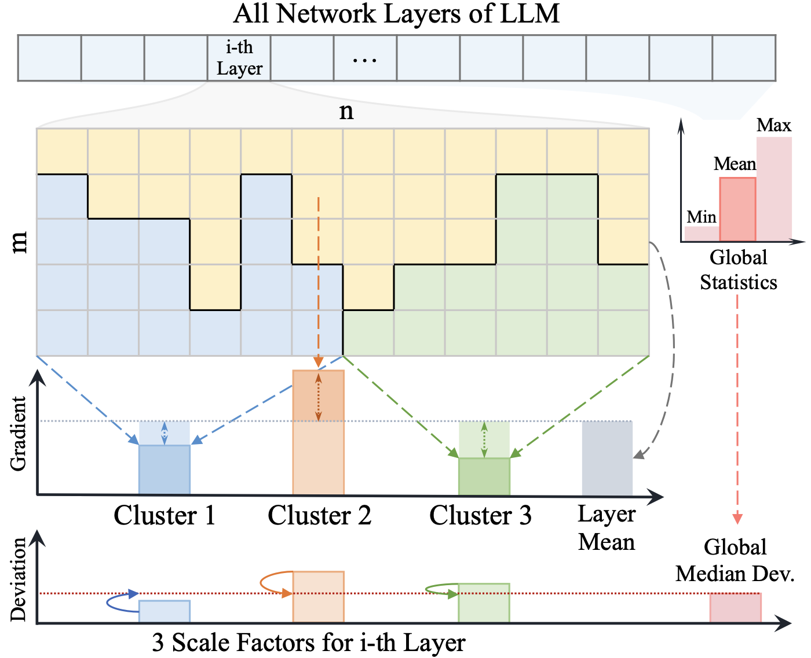

<div align="center">
<h1>Taming LLMs by Scaling Learning Rates with Gradient Grouping</h1>

<a href="https://arxiv.org/pdf/2506.01049" target="_blank" rel="noopener noreferrer">
  
</a>
<a href="https://arxiv.org/abs/2506.01049"></a>
<a href='https://huggingface.co/papers/2506.01049'></a>

[Siyuan Li*](https://lupin1998.github.io), [Juanxi Tian*](), [Zedong Wang*](https://jacky1128.github.io), [Xin Jin](https://jinxins.github.io), [Zicheng Liu](https://scholar.google.com/citations?hl=en&user=EwMGZsgAAAAJ), [Wentao&nbsp;Zhang](https://zwt233.github.io), [Dan Xu](https://www.danxurgb.net)

**[Zhejiang University](https://www.zju.edu.cn/english/)**; **[Westlake University](https://en.westlake.edu.cn)**; **[HKUST](https://hkust.edu.hk)**; **[Peking University](https://english.pku.edu.cn)**

</div>

```bibtex
@inproceedings{acl2025sgg,
     title={Taming LLMs with Gradient Grouping},
     author={Li, Siyuan and Tian, Juanxi and Wang, Zedong and Jin, Xin and Liu, Zicheng and Zhang, Wentao and Xu, Dan},
     booktitle={Annual Meeting of the Association for Computational Linguistics},
     year={2025}
  }

@article{acl2025sgg,
  title={Taming LLMs by Scaling Learning Rates with Gradient Grouping},
  author={Li, Siyuan and Tian, Juanxi and Wang, Zedong and Jin, Xin and Liu, Zicheng and Zhang, Wentao and Xu, Dan},
  journal={arXiv preprint arXiv:2506.01049},
  year={2025}
}
```

## Coming Soon

<p align="center">
  
</p>
<p align="center">
  
</p>

